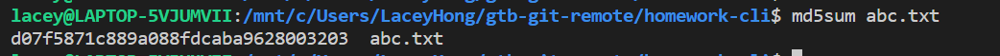
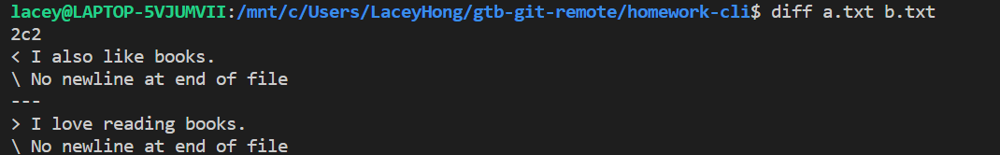
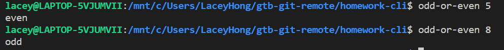
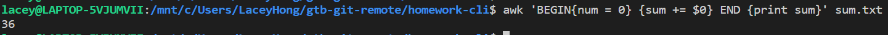

# CLI Basics Homework Answer
## Problem 1
找到在 Ubuntu 系统中可以用于计算文件内容 MD5 值的命令
### Answer
代码如下：
 `md5sum abc.txt`
结果如下：



## Problem 2
找到在 Ubuntu 系统中可以用于比较两个文件的内容的差异的命令
### Answer
代码如下：
`diff a.txt b.txt`
结果如下：


## Problem 3
实现一个名为 odd-or-even 的 Bash function，可以用来判断给其提供的第一个参数是奇数还是偶数，奇数时输出 odd，偶数时输出 even
### Answer
首先使用以下代码代开文件：
 `vi ~/.bashrc`  
其次定义odd-or-even函数,代码如下：
(```)
  function odd-or-even(){
if (( $@%2 == 0 ));then
        echo "odd"
else
        echo "even"
fi
(```)
结果如下：


## Problem 4
实现一个名为 next 的脚本，当在 CLI 里执行 $ next （$为提示符，不需要输入）时就返回一个整数，第一次返回 1，每执行一次加 1
### Answer
详细答案请参阅next脚本内容

## Problem 5
一个文件含有 N 行内容，每行的内容都是一个大于等于 0 的整数，无任何空行或其它内容，使用 one-liner 的形式对该文件中的数字求和
### Answer
代码如下：
 `awk 'BEGIN{num = 0} {sum += $0} END {print sum}' sum.txt`  

结果如下：

